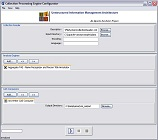
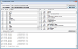
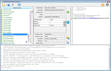
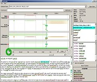
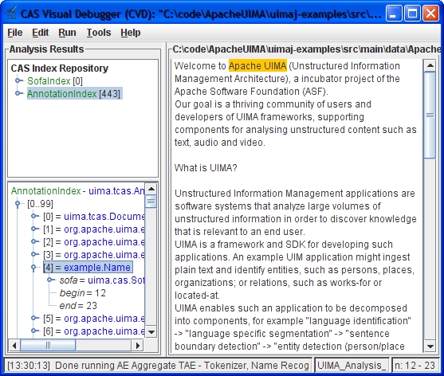
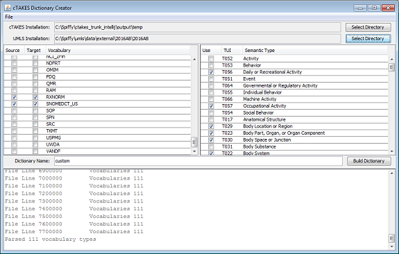
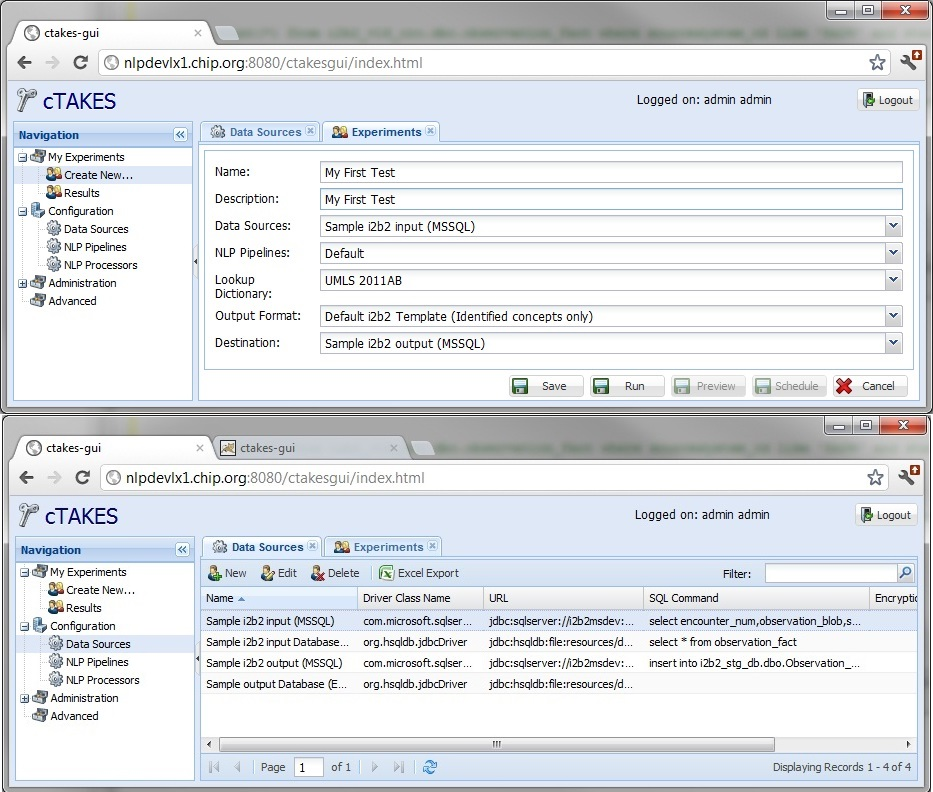
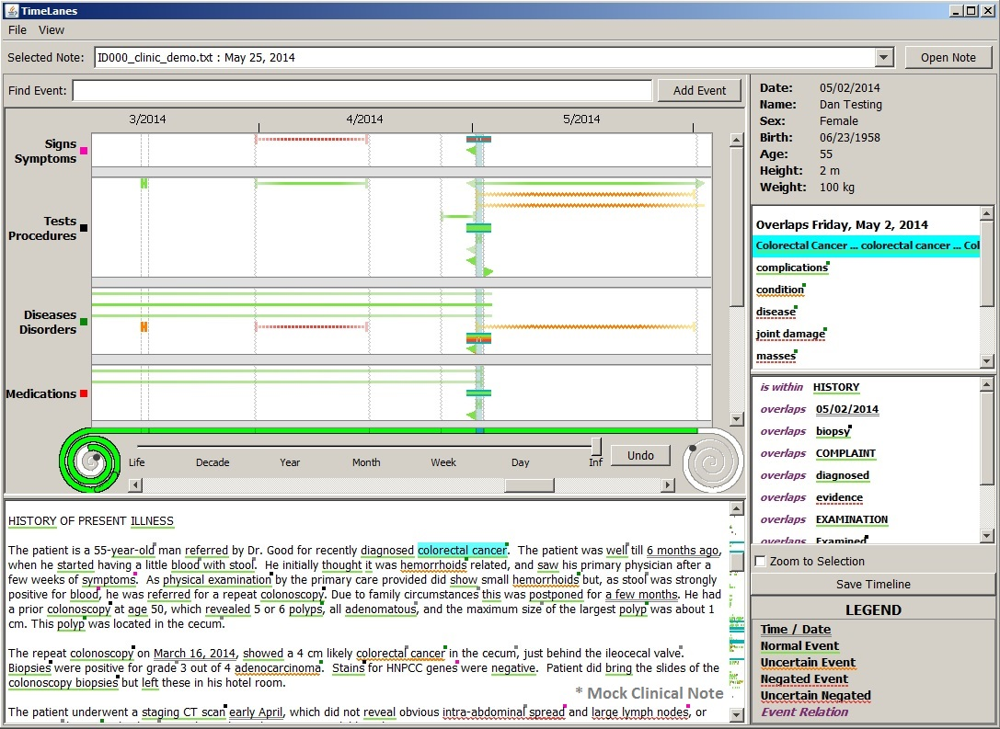

Title: Examples

   

      <h1>Examples</h1>
      
Select a thumbnail above to view a larger image. Click larger image to open a page with additional information.

   

   

      

         

            
            

               <h4>UIMA&trade; CVD</h4>
            

         

      

      

         

            
            

               <h4>UIMA&trade; CPE</h4>
            

         

      

      

         

            
            

               <h4>Dictionary Creator</h4>
            

         

      

      

         

            
            

               <h4>Piper Fabricator</h4>
            

         

      

      

         

            
            

               <h4>cTAKES&trade; GUI</h4>
            

         

      

      

         

            
            

               <h4>TimeLanes</h4>
            

         

      

      <!--  INFO and TITLE PANEL  -->
      

         

            <h4>Apache <abbr title="Unstructured Information Management applications">UIMA&trade;</abbr>
               Cas Visual Debugger (CVD) 
               <small>Process raw text and view <abbr title="Natural Language Processing">NLP</abbr> metadata</small>
            </h4>
         

         

            <h4>Apache <abbr title="Unstructured Information Management applications">UIMA&trade;</abbr>
               Collection Processing Engine configurator (CPE) 
               <small>Process a multiple document batch</small>
            </h4>
         

         

            <h4>cTAKES Dictionary Creator GUI</abbr> 
               <small>Create a cTAKES dictionary from the NLM UMLS</small>
            </h4>
         

         

            <h4>Simple Piper Fabricator GUI</abbr> 
               <small>Create a custom pipeline</small>
            </h4>
         

         

            <h4>cTAKES <abbr title="Graphical User Interface">GUI</abbr> 
               <small>Process raw text in a web browser</small>
            </h4>
         

         

            <h4>TimeLanes 
               <small>View extracted UMLS and Temporal information</small>
            </h4>
         

      

   

   

      

         

            
         

         

            
         

         

            
         

         

            
         

         

            
         

         

            
         

      

   

<!-- show enlarged image -->

